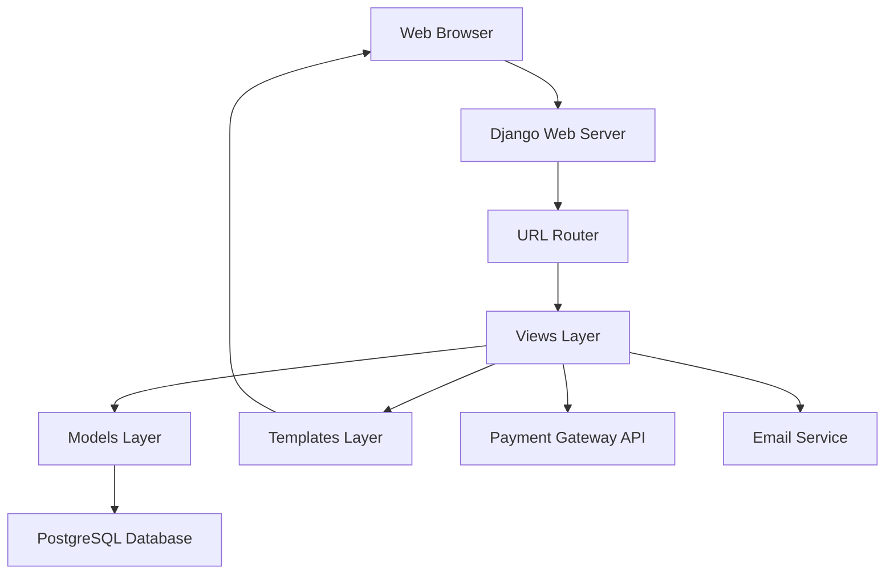

# Design Document

## Overview

The Django ecommerce website will be built using Django 4.x with a modular architecture that separates concerns into distinct apps. The system will use Django's built-in authentication, PostgreSQL for data persistence, and integrate with payment processors like Stripe. The frontend will use Django templates with Bootstrap for responsive design.

## Architecture

### High-Level Architecture



### Django Apps Structure

- **accounts**: User authentication, registration, and profile management
- **products**: Product catalog, categories, and inventory management
- **cart**: Shopping cart functionality and session management
- **orders**: Order processing, checkout, and order history
- **payments**: Payment processing integration
- **core**: Shared utilities, base templates, and common functionality

## Components and Interfaces

### Models Layer

#### User Model (Extended)
```python
# Custom user profile extending Django's User model
class UserProfile(models.Model):
    user = models.OneToOneField(User, on_delete=models.CASCADE)
    phone = models.CharField(max_length=20)
    date_of_birth = models.DateField(null=True, blank=True)
    created_at = models.DateTimeField(auto_now_add=True)
```

#### Product Models
```python
class Category(models.Model):
    name = models.CharField(max_length=100)
    slug = models.SlugField(unique=True)
    description = models.TextField(blank=True)
    
class Product(models.Model):
    name = models.CharField(max_length=200)
    slug = models.SlugField(unique=True)
    category = models.ForeignKey(Category, on_delete=models.CASCADE)
    description = models.TextField()
    price = models.DecimalField(max_digits=10, decimal_places=2)
    stock_quantity = models.PositiveIntegerField()
    is_active = models.BooleanField(default=True)
    created_at = models.DateTimeField(auto_now_add=True)
```

#### Cart and Order Models
```python
class Cart(models.Model):
    user = models.ForeignKey(User, on_delete=models.CASCADE, null=True, blank=True)
    session_key = models.CharField(max_length=40, null=True, blank=True)
    created_at = models.DateTimeField(auto_now_add=True)

class CartItem(models.Model):
    cart = models.ForeignKey(Cart, on_delete=models.CASCADE)
    product = models.ForeignKey(Product, on_delete=models.CASCADE)
    quantity = models.PositiveIntegerField(default=1)

class Order(models.Model):
    user = models.ForeignKey(User, on_delete=models.CASCADE)
    status = models.CharField(max_length=20, choices=ORDER_STATUS_CHOICES)
    total_amount = models.DecimalField(max_digits=10, decimal_places=2)
    shipping_address = models.TextField()
    created_at = models.DateTimeField(auto_now_add=True)
```

### Views Layer

#### Class-Based Views Structure
- **ProductListView**: Display products with filtering and pagination
- **ProductDetailView**: Show individual product details
- **CartView**: Manage cart contents and updates
- **CheckoutView**: Handle checkout process
- **OrderHistoryView**: Display user's order history
- **AdminDashboardView**: Administrative interface

#### API Endpoints
- `/api/cart/add/`: Add items to cart (AJAX)
- `/api/cart/update/`: Update cart quantities (AJAX)
- `/api/cart/remove/`: Remove items from cart (AJAX)
- `/api/products/search/`: Product search functionality

### Templates Layer

#### Template Hierarchy
```
templates/
├── base.html (Main layout with Bootstrap)
├── includes/
│   ├── navbar.html
│   ├── footer.html
│   └── messages.html
├── products/
│   ├── product_list.html
│   └── product_detail.html
├── cart/
│   └── cart.html
├── orders/
│   ├── checkout.html
│   └── order_history.html
└── accounts/
    ├── login.html
    ├── register.html
    └── profile.html
```

## Data Models

### Database Schema

#### Core Entities
1. **Users**: Extended Django User model with profile information
2. **Categories**: Product categorization with hierarchical support
3. **Products**: Main product catalog with inventory tracking
4. **Cart/CartItems**: Session-based and user-based cart management
5. **Orders/OrderItems**: Order processing and history
6. **Addresses**: Shipping and billing address management
7. **Payments**: Payment transaction records

#### Relationships
- User 1:1 UserProfile
- Category 1:N Products
- User 1:N Orders
- Order 1:N OrderItems
- Product 1:N OrderItems
- User 1:1 Cart (for logged-in users)
- Cart 1:N CartItems

### Data Validation
- Product prices must be positive decimals
- Stock quantities cannot be negative
- Email addresses must be unique and valid
- Phone numbers follow standard format validation
- Order totals must match sum of line items

## Error Handling

### Exception Management
- **ValidationError**: Handle form and model validation failures
- **Http404**: Product not found, invalid URLs
- **PermissionDenied**: Unauthorized access to admin or user-specific content
- **PaymentError**: Payment processing failures with user-friendly messages

### Error Pages
- Custom 404 page for missing products/pages
- Custom 500 page for server errors
- Payment failure page with retry options
- Out of stock notifications

### Logging Strategy
- Django logging for application errors
- Payment transaction logging for audit trails
- User action logging for analytics
- Performance monitoring for slow queries

## Testing Strategy

### Unit Testing
- Model validation and business logic
- Form validation and processing
- Utility functions and helpers
- Payment processing logic

### Integration Testing
- Cart functionality end-to-end
- Checkout process flow
- User registration and authentication
- Admin product management

### Frontend Testing
- AJAX cart operations
- Form submissions and validation
- Responsive design across devices
- JavaScript functionality

### Performance Testing
- Database query optimization
- Page load times under load
- Cart and checkout performance
- Search functionality speed

### Security Testing
- Authentication and authorization
- Payment data handling
- SQL injection prevention
- CSRF protection validation

## Security Considerations

### Data Protection
- HTTPS enforcement for all pages
- Secure payment data handling (PCI compliance)
- Password hashing with Django's built-in system
- Session security and timeout management

### Access Control
- Role-based permissions for admin functions
- User-specific data access restrictions
- Cart isolation between users/sessions
- Order access limited to order owners

### Input Validation
- Server-side validation for all forms
- SQL injection prevention through ORM
- XSS protection in templates
- File upload security for product images

## Performance Optimization

### Database Optimization
- Proper indexing on frequently queried fields
- Query optimization with select_related and prefetch_related
- Database connection pooling
- Caching for product catalogs and categories

### Frontend Optimization
- Static file compression and minification
- Image optimization and lazy loading
- CDN integration for static assets
- Browser caching strategies

### Caching Strategy
- Redis for session storage and cart data
- Template fragment caching for product lists
- Database query result caching
- Full-page caching for static content